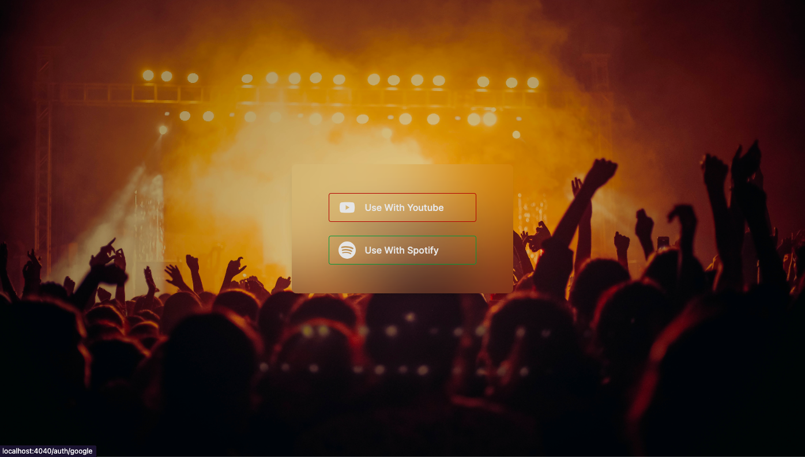
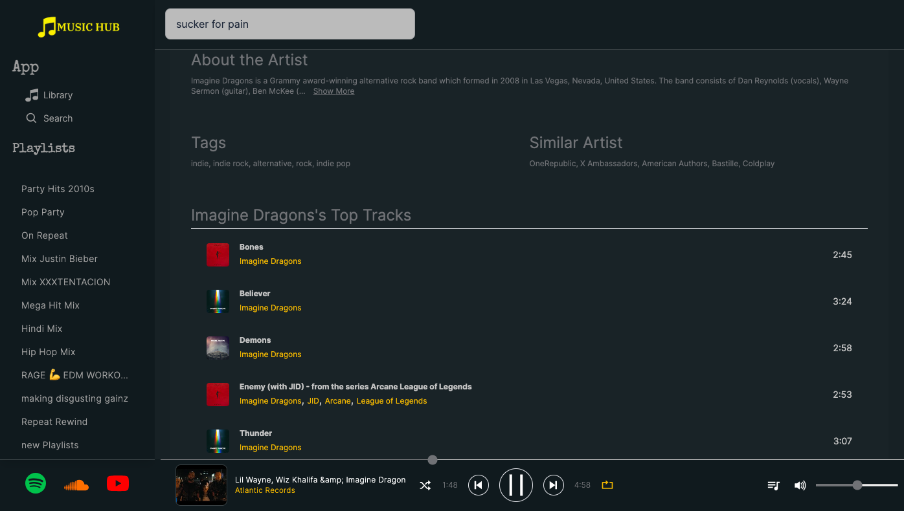
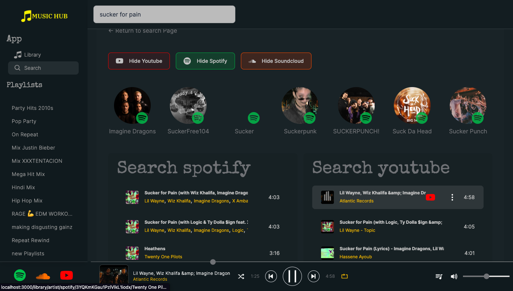

# MusicHub




## Usage

Clone it!

```sh
$ git clone https://github.com/Amit91848/Musichub-client/
```

.env file example

```
NEXT_PUBLIC_BACKEND_URL=
```

Go into the project directory and run the command:

```sh
npm install
```

## Technologies Used

-   NextJs
-   Redux Toolkit
-   Tailwind Css
-   Daisy UI

## Backend

<a href="https://github.com/Amit91848/Musichub-server">Link for Backend repository</a>

## More images

-   ### Playlist Page

    

-   ### About Artist

    

-   ### Search Page
    
