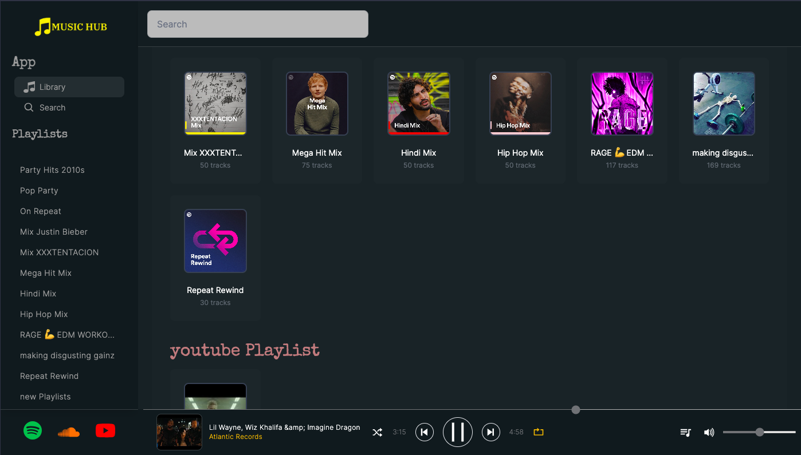
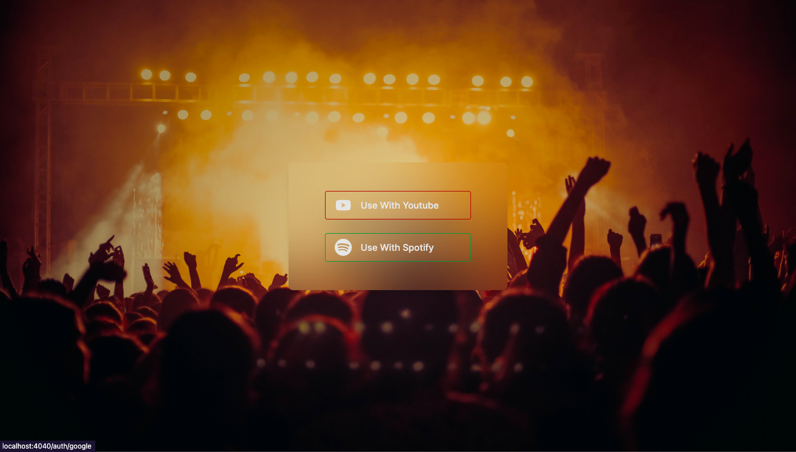
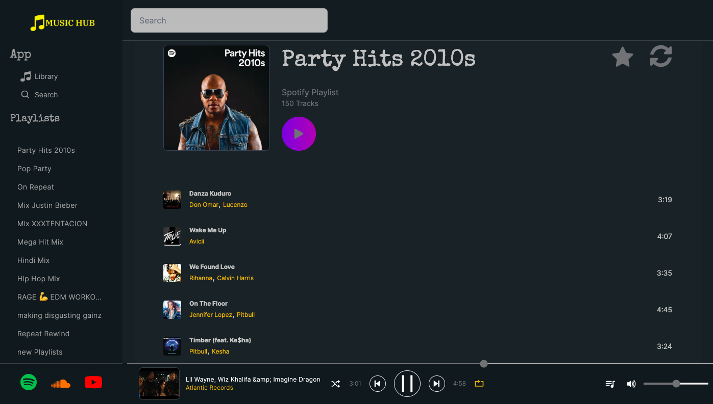
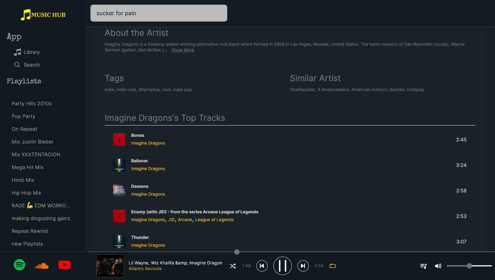

# MusicHub





## Usage

Clone it!

```sh
$ git clone https://github.com/Amit91848/Musichub-server/
```

.env file example

```
PORT=
SPOTIFY_CLIENT_ID=
SPOTIFY_CLIENT_SECRET=
DATABASE=
GOOGLE_CLIENT_ID=
GOOGLE_CLIENT_SECRET=
MONGO_URI=
JWT_EXPIRES_IN=
JWT_SECRET=
SESSION_SECRET=
SUCCESS_REDIRECT=
FAILED_REDIRECT=
SPOTIFY_BASE_URL=
YOUTUBE_BASE_URL=
YOUTUBE_API_KEY=
FRONTEND_URL=
REDIS_HOST=
REDIS_PASSWORD=
REDIS_PORT=
```

```sh
$ git clone https://github.com/Amit91848/Musichub-server/
```

Go into the project directory and run the command:

```sh
yarn install
```

Server will be running on https://localhost:4000

## Technologies Used

- ExpressJs
- Jsonwebtoken
- Mongoose
- PassportJs
- Redis
- Axios
- Argon2

## Frontend

<a href="https://github.com/Amit91848/Musichub-client">Link for frontend repository</a>

## More images

- ### Playlist Page

  

- ### About Artist

  

- ### Search Page
  
